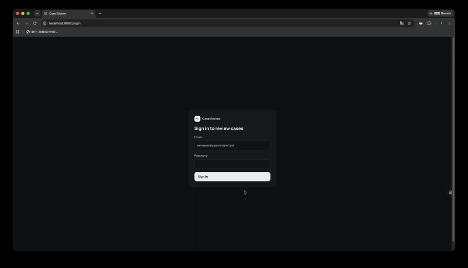

# Case Review (demo)

AI-assisted mortgage document review. Uploads are parsed (LlamaParse), classified and scored (TypeSafe Jev), extracted (Claude), then turned into a DTI and a recommendation. A reviewer always makes the decision; every edit and decision is audit-logged.

Synthetic data only. Localhost only.



## Prerequisites

- Go 1.26+
- Node.js >= 22, pnpm (`corepack enable` if `pnpm` is missing)
- For real mode only: Anthropic, LlamaParse, and TypeSafe API keys. spanbox (optional, for tracing) is a separate local service.

## Project layout

- `backend/` — Go server (`cmd/server`), data generator (`cmd/gendata`), eval harness (`cmd/eval`)
- `frontend/` — Vite + React reviewer UI
- `testdata/documents/` — synthetic PDFs per scenario, used for demos and eval
- `docs/` — architecture diagrams

## Run without API keys (fake pipeline)

```bash
cd frontend && pnpm install && pnpm build && cd ..
cd backend && PIPELINE_MODE=fake go run ./cmd/server
# open http://localhost:8080 — reviewer@casereview.test / casereview-demo
```

Upload PDFs from `testdata/documents/<scenario>/`. Unmarked files named `w2.pdf`, `form-1040.pdf`, `form-1003.pdf`, `pay-stub.pdf`, or `bank-statement-lowq.png` continue to use fixed fake values. Generated PDFs carry their own field values.

## Demo cases

1. Run in fake mode and sign in as above.
2. For **each** folder in `testdata/documents/` (`standard`, `boundary`, `above_limit`, `missing_docs`, `low_quality_scan`, `tampered_statement`, `unsupported_doc`), click **New case**. Enter the borrower's name printed in its `form-1003.pdf`, a unique loan number (for example, `DEMO-standard`), loan product `Conventional 30yr fixed`, and requested amount `410000`.
3. Click **Create case**, then **Add documents** and select every PDF in that folder. Wait for processing, then repeat for the next folder. Do not mix folders in the same case.
4. Compare the queue: `standard` → **Ready for decision** (good, Approve enabled), `boundary` → **DTI near 43% limit** (warn), `above_limit` → **DTI above 43%** (bad). The other cases demonstrate missing documents, low-quality scanning, a tampered bank statement, and an unsupported license.

`testdata/documents/live_demo/` is a separate set for a live walkthrough (borrower Ray Tien, blurred bank statement, stops at **1 field to verify**). It has no eval fixture; upload it in real mode during a demo.

Regenerate the synthetic PDFs and matching fixtures with `cd backend && go run ./cmd/gendata`. All identities, employers, and banks are fictional.

## Run for real

```bash
cp .env.example .env   # fill keys; never commit this file
# optional observability: start spanbox (github.com/Ray0907/spanbox) on :4318 separately
set -a && source .env && set +a
cd backend && go run ./cmd/gendata
go run ./cmd/server        # http://localhost:8080
```

If spanbox is not running, leave `ANTHROPIC_BASE_URL` and `SPANBOX_TOKEN` empty to call Anthropic directly. Real mode also needs LlamaParse and TypeSafe keys.

## Eval

```bash
cd backend
go run ./cmd/eval -fake                # keyless harness check, no model claims
set -a && source ../.env && set +a    # real run only
go run ./cmd/eval                      # real models; prints spanbox session id
```

The report is `eval/report.json`. In spanbox, filter by the printed `eval-<ts>` session to inspect the prompt/completion behind a miss. The fake eval exercises the same runner and seven fixture scenarios, not model accuracy.

## Tests

```bash
cd backend && go vet ./... && go test -race ./...
cd ../frontend && pnpm build && pnpm e2e
cd ../backend && go run ./cmd/eval -fake
```

The E2E script writes screenshots, `results.json`, and `summary.txt` to `artifacts/e2e/<git-describe>/`.

## Troubleshooting

- **Server won't start / missing keys** — real mode needs `ANTHROPIC_API_KEY`, `LLAMAPARSE_API_KEY`, `TYPESAFE_API_KEY` set (via `.env`, sourced with `set -a && source .env && set +a`). Fake mode (`PIPELINE_MODE=fake`) needs none of them.
- **Port 8080 already in use** — another `go run ./cmd/server` instance is likely still running; find and kill it, or set a different port if the server supports one.
- **`ANTHROPIC_BASE_URL` set but spanbox not running** — requests will fail; either start spanbox on `:4318` or clear `ANTHROPIC_BASE_URL`/`SPANBOX_TOKEN` to call Anthropic directly.
- **Mixing fake and real mode data** — `PIPELINE_MODE` must match how a case's documents were generated; don't upload real-mode extractions into a fake-mode session or vice versa.
- **`npm` commands fail or behave oddly** — this repo uses pnpm; run `pnpm install` first, not `npm install`.

## Scenarios

| ID | What it shows |
|---|---|
| standard | complete file, DTI 29.2%, eligible |
| boundary | DTI 42.8% next to the 43% QM line, needs review |
| above_limit | DTI 50%, ineligible |
| missing_docs | Form 1040 absent |
| low_quality_scan | noisy bank statement, flagged field must be verified before approval |
| tampered_statement | altered ending balance ($4,000 discrepancy) with a mismatched font; needs review |
| unsupported_doc | driver's license classified as unsupported |
